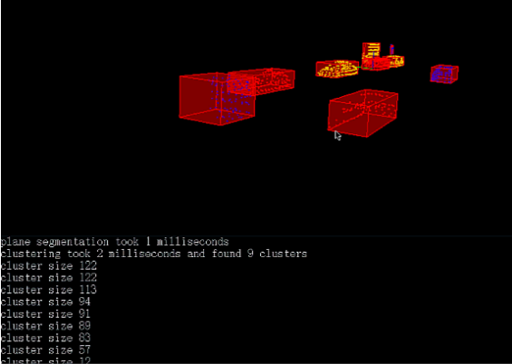

# Sensor Fusion Nanodegree

## Lidar Obstacle Detection Project
Luciano Silveira
June, 2020

### Specification

Followed te steps from the [README](./README.md) file.

### Result

The final result can be checked with this [sample video](./data/sample01.mp4).

### Links

 * [Original Repository](https://github.com/udacity/SFND_Lidar_Obstacle_Detection)
 * [Project Rubric](https://review.udacity.com/#!/rubrics/2529/view)
